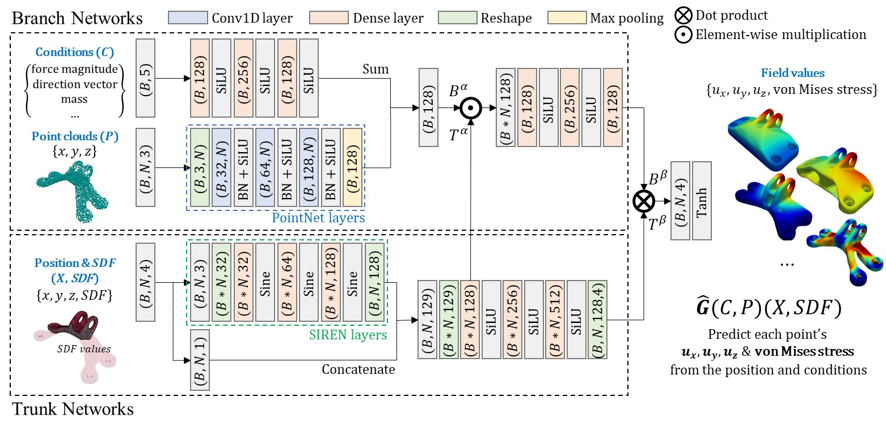

# Point-DeepONet: A Deep Operator Network Integrating PointNet for Nonlinear Analysis of Non-Parametric 3D Geometries and Load Conditions

This repository contains the code and workflow used for the research presented in the paper:

> **Point-DeepONet: A Deep Operator Network Integrating PointNet for Nonlinear Analysis of Non-Parametric 3D Geometries and Load Conditions**  
> Jangseop Park and Namwoo Kang.

**Abstract:**  
Nonlinear structural analyses in engineering often require extensive finite element simulations, limiting their applicability in design optimization, uncertainty quantification, and real-time control. Conventional deep learning surrogates, such as convolutional neural networks (CNNs), physics-informed neural networks (PINNs), and fourier neural operators (FNOs), face challenges with complex non-parametric three-dimensional (3D) geometries, directionally varying loads, and high-fidelity predictions on unstructured meshes. This work presents Point-DeepONet, an operator-learning-based surrogate that integrates PointNet into the DeepONet framework. By directly processing non-parametric point clouds and incorporating signed distance functions (SDF) for geometric context, Point-DeepONet accurately predicts three-dimensional displacement and von Mises stress fields without mesh parameterization or retraining. Trained using only about 5,000 nodes (2.5\% of the original 200,000-node mesh), Point-DeepONet can still predict the entire mesh at high fidelity, achieving a coefficient of determination (R²) reaching 0.987 for displacement and 0.923 for von Mises stress under a horizontal load case. Compared to nonlinear finite element analyses that require about 19.32 minutes per case, Point-DeepONet provides predictions in mere seconds—approximately 400 times faster—while maintaining excellent scalability and accuracy with increasing dataset sizes. These findings highlight the potential of Point-DeepONet to enable rapid, high-fidelity structural analyses, ultimately supporting more effective design exploration and informed decision-making in complex engineering workflows.

**Point-DeepONet** achieves significant speedups (over 400 times faster) compared to nonlinear finite element analyses while maintaining high predictive accuracy.



---

## Project Structure

<pre>
.
├── 1.Data_preprocessing
│   ├── 1.1.data_sampling.ipynb
│   └── 1.2.split_dataset.ipynb
├── 2.Data_visualization
│   ├── 2.1.visualize_vtk.ipynb
│   └── 2.2.visualize_point_clouds.ipynb
├── 3.PointNet
│   ├── main.py
│   └── PointNet.ipynb
├── 4.DeepONet
│   ├── DeepONet.ipynb
│   └── main.py
├── 5.Point_DeepONet
│   ├── main.py
│   └── PointDeepONet.ipynb
├── data
│   ├── bracket_labels.csv <span style="color: yellow;">(Download)</span>
│   ├── npy
│   │   ├── combined_3000_mass.npz <span style="color: green;">(Generated by 1.2~.ipynb)</span>
│   │   ├── combined_3000_split_random_train_valid.npz <span style="color: green;">(Generated by 1.2~.ipynb)</span>
│   │   ├── targets.npz <span style="color: yellow;">(Download)</span>
│   │   └── xyzdmlc.npz <span style="color: yellow;">(Download)</span>
│   ├── sampled <span style="color: green;">(Generated by 1.1~.ipynb)</span>
│   │   ├── Rpt0_N10000.npz
│   │   └── ...
│   └── VolumeMesh <span style="color: yellow;">(Download)</span>
│       ├── 101_428.vtk
│       └── ...
├── experiments <span style="color: green;">(Generated by training)</span>
├── figures <span style="color: green;">(Generated by training and 1.1~2.2.ipynb)</span>
└── requirements.txt 
</pre>

## Data Download Note

- **Required Files:**
  - `data/bracket_labels.csv`
  - `data/npy/targets.npz`
  - `data/npy/xyzdmlc.npz`
  - All files in `data/VolumeMesh/`
  
  Download from our [Kaggle dataset](https://www.kaggle.com/datasets/jangseop/point-deeponet-dataset) and place them in their respective directories.

## Getting Started

### 1. Clone the Repository

```bash
    git clone https://github.com/yourusername/Point-DeepONet.git
    cd Point-DeepONet
```

### 2. Install Dependencies

Ensure Python 3.7+ is installed. Then run:

```bash
    pip install -r requirements.txt
```

### 3. Data Preparation
#### 3.1. Data Sampling

- **Notebook:** `1.Data_preprocessing/1.1.data_sampling.ipynb`

Sample point clouds from finite element meshes.

```bash
    jupyter notebook 1.Data_preprocessing/1.1.data_sampling.ipynb
```

#### 3.2. Dataset Splitting

Split dataset into training and validation sets.

```bash
    jupyter notebook 1.Data_preprocessing/1.2.split_dataset.ipynb
```

#### 3.3. Verification
Load and inspect `.npz` files to ensure data integrity.

### 4. Data Visualization

Note: Install OpenGL for PyVista:

```bash
    sudo apt-get update
    sudo apt-get install libgl1-mesa-glx
```

#### 4.1. visualize VTK files

- **Notebook:** `2.Data_visualization/2.1.visualize_vtk.ipynb`

Visualize finite element meshes and simulation results.

```bash
    jupyter notebook 2.Data_visualization/2.1.visualize_vtk.ipynb
```

#### 4.2.visualize point clouds
Inspect sampled point cloud data.

```bash
    jupyter notebook 2.Data_visualization/2.2.visualize_point_clouds.ipynb
```

### 5. Model Training 
#### 5.1. **PointNet**

- **Script:** `3.PointNet/main.py`

```bash
    python main.py \
        --gpu 0 \
        --RUN 0 \
        --input_components xyzmlc \
        --output_components xyzs \
        --N_pt 5000 \
        --N_iterations 4000 \
        --batch_size 32 \
        --learning_rate 0.0005 \
        --dir_base_load_data ../data/sampled \
        --N_samples 3000 \
        --split_method random \
        --scaling 0.53 \
        --base_dir ../experiments
```
- **Notebook:** `3.PointNet/PointNet.ipynb`

```bash
    jupyter notebook 3.PointNet/PointNet.ipynb
```

#### 5.2. **DeepONet**
- **Script:** `4.DeepONet/main.py`
```bash
    python main.py \
        --gpu 0 \
        --RUN 0 \
        --branch_input_components mlc \
        --trunk_input_components xyzd \
        --output_components xyzs \
        --N_pt 5000 \
        --N_iterations 40000 \
        --batch_size 16 \
        --learning_rate 0.001 \
        --dir_base_load_data ../data/sampled \
        --N_samples 3000 \
        --split_method random \
        --base_dir ../experiments
```

- **Notebook:** `4.DeepONet/DeepONet.ipynb`

```bash
    jupyter notebook 4.DeepONet/DeepONet.ipynb
```

#### 5.3. **Point-DeepONet**
- **Script:** `5.Point_DeepONet/main.py`

```bash
    python main.py \
        --gpu 0 \
        --RUN 0 \
        --branch_condition_input_components mlc \
        --trunk_input_components xyzd \
        --output_components xyzs \
        --N_pt 5000 \
        --N_iterations 40000 \
        --batch_size 16 \
        --learning_rate 0.001 \
        --dir_base_load_data ../data/sampled \
        --N_samples 3000 \
        --split_method random \
        --base_dir ../experiments \
        --branch_hidden_dim 100 \
        --trunk_hidden_dim 100 \
        --trunk_encoding_hidden_dim 100 \
        --fc_hidden_dim 100
```

- **Notebook:** `5.Point_DeepONet/PointDeepONet.ipynb`

```bash
    jupyter notebook 5.Point_DeepONet/PointDeepONet.ipynb
```

### 6. Model Evaluation
Use the `experiments` and `figures` directories to assess model performance and visualize results.


## Additional Notes
- **Hardware Requirements:**  
  Training large models requires GPUs with substantial memory (e.g., NVIDIA A100).

<!-- - **Citations:**  
  If you find this code useful, please cite our paper:
  
  ```bibtex
  @article{park2024point,
    title={Point-DeepONet: A Deep Operator Network Integrating PointNet for Nonlinear Analysis of Non-Parametric 3D Geometries and Load Conditions},
    author={Park, Jangseop and Kang, Namwoo},
    journal={Computer Methods in Applied Mechanics and Engineering},
    year={2024}
  } -->


## Contact

For questions, support, or collaboration inquiries, please reach out to:

- **Jangseop Park**  
  Email: [jangseop@kaist.ac.kr](mailto:jangseop@kaist.ac.kr)  
  Homepage: [Link](https://bit.ly/jangseop).  
  GitHub: [@jangseop-park](https://github.com/jangseop-park)

- **Namwoo Kang**  
  Email: [nwkang@kaist.ac.kr](mailto:nwkang@kaist.ac.kr)  
  Homepage: [Link](https://www.smartdesignlab.org/).
  
Feel free to reach out for any inquiries related to this project.
